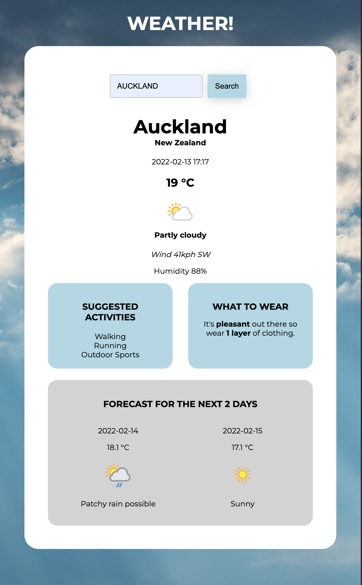

# Weather App

## Getting Started
You can watch a live demo of this app on [YouTube](https://youtube.com/shorts/jiO7qibmOx8?feature=share)

### API Key required

If you are using this repo you will need to add a .env file with WEATHER_API_KEY="<insert-key-here>"
[Sign up for key](https://www.weatherapi.com/signup.aspx)

### Installation

```
npm install
npm run knex migrate:latest 
npm run knex seed:run
npm run dev
```

You can find the server running on [http://localhost:3000](http://localhost:3000).



## Details

This Weather App is built from the [Weather API](https://www.weatherapi.com/)
